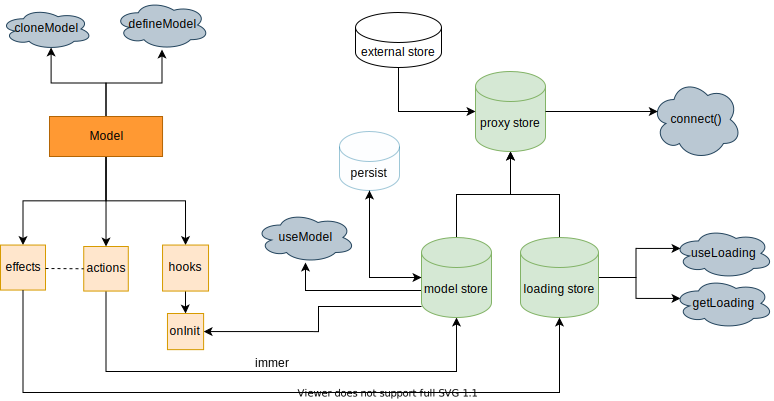

# FOCA

流畅的 react 状态管理库，基于[redux](https://github.com/reduxjs/redux)和[react-redux](https://github.com/reduxjs/react-redux)。简洁、极致、高效。

 

# 使用环境

- 现代化浏览器
- React Native
- Taro
- Electron
- IE (配合 [polyfills](https://stackoverflow.com/questions/57020976/polyfills-in-2019-for-ie11))

|  IE |  Edge |  Chrome |  Firefox |  Safari |  iOS Safari |  Opera |
| ------------------------------------------------------------------------------------------------------------------------------------------------------------------------------------------ | ------------------------------------------------------------------------------------------------------------------------------------------------- | --------------------------------------------------------------------------------------------------------------------------------------------------------- | ------------------------------------------------------------------------------------------------------------------------------------------------------------- | --------------------------------------------------------------------------------------------------------------------------------------------------------- | ------------------------------------------------------------------------------------------------------------------------------------------------------------------------- | ----------------------------------------------------------------------------------------------------------------------------------------------------- |
| 10+                                                                                                                                                                                        | 12+                                                                                                                                               | 45+                                                                                                                                                       | 34+                                                                                                                                                           | 9+                                                                                                                                                        | 9+                                                                                                                                                                        | 32+                                                                                                                                                   |

# 特性

#### 模块化开发，导出即可使用

一个模型包含了状态操作的所有方法，基础代码全部剥离，不再像原生 redux 一般拆分成 action/types/reducers 三个文件，既不利于管理，又难以在提示上关联起来。

定义完模型，导出即可在组件中使用，不用再怕忘记注册或者嫌麻烦了。

#### 专注 TS 极致体验，100%类型提示

无 TS 不编程，foca 提供 **100%** 的基础类型提示，能产生一种提示上瘾的快感，而你只需关注业务中的类型。

#### 内置 [immer](https://github.com/immerjs/immer) 响应式修改数据

可以说加入 immer 是非常有必要的，当 reducer 数据多层嵌套时，你不必再忍受更改里层的数据而不断使用 rest/spread(...)扩展符的烦恼，相反地，直接赋值就好了，其他的交给 immer 搞定。

#### 支持 computed 计算属性，自动收集依赖

现在，redux 家族不需要再羡慕`vue`或者`mobx`等响应式框架，咱也能支持计算属性并且自动收集依赖，而且是时候把[reselect](https://github.com/reduxjs/reselect)**扔进垃圾桶**了。

#### 支持私有方法

一个前置下划线(`_`)就能让方法变成私有的，外部使用时 TS 不会提示私有方法和私有变量，简单好记又省心。

#### 自动管理异步函数的 loading 状态

我们总是想知道某个异步方法（或者请求）正在执行，然后在页面上渲染出`loading...`字样，幸运地是框架自动（按需）为你记录了执行状态。

#### 可定制的多引擎数据持久化

某些数据在一个时间段内可能是不变的，比如登录凭证 token。所以你想着先把数据存到本地，下次自动恢复到模型中，这样用户就不需要频繁登录了。

# 缺陷

- [不支持 SSR](/troubleshooting?id=为什么不支持-ssr)

# 生态

#### 网络请求

| 仓库                                                                        | 版本                                                                                                                | 描述                           | 平台      |
| --------------------------------------------------------------------------- | ------------------------------------------------------------------------------------------------------------------- | ------------------------------ | --------- |
| [axios](https://github.com/axios/axios)                                     |                                    | 当下最流行的请求库             | React, RN |
| [foca-axios](https://github.com/foca-js/foca-axios)                         |                          | axios 适配器，节流、缓存、重试 | React, RN |
| [foca-miniprogram-axios](https://github.com/foca-js/foca-miniprogram-axios) |  | axios 适配器，节流、缓存、重试 | Taro      |

#### 存储引擎

| 仓库                                                                                      | 版本                                                                                                                                                      | 描述                                       | 平台  |
| ----------------------------------------------------------------------------------------- | --------------------------------------------------------------------------------------------------------------------------------------------------------- | ------------------------------------------ | ----- |
| [react-native-async-storage](https://github.com/react-native-async-storage/async-storage) |  | React-Native 持久化引擎                    | RN    |
| [foca-taro-storage](https://github.com/foca-js/foca-taro-storage)                         |                                                  | Taro 持久化引擎                            | Taro  |
| [localforage](https://github.com/localForage/localForage)                                 |                                                              | 浏览器端持久化引擎，支持 IndexedDB, WebSQL | React |
| [foca-cookie-storage](https://github.com/foca-js/foca-cookie-storage)                     |                                              | Cookie 持久化引擎                          | React |

#### 日志

| 仓库                                                                       | 版本                                                                                                                      | 描述           | 平台            |
| -------------------------------------------------------------------------- | ------------------------------------------------------------------------------------------------------------------------- | -------------- | --------------- |
| [@redux-devtools/extension](https://github.com/reduxjs/redux-devtools)     |  | 浏览器日志插件 | React, RN       |
| [react-native-debugger](https://github.com/jhen0409/react-native-debugger) |          | 日志应用程序   | RN              |
| [redux-logger](https://github.com/LogRocket/redux-logger)                  |                            | 控制台输出日志 | React, RN, Taro |

# 例子

React 案例仓库：https://github.com/foca-js/foca-demo-web
 
RN 案例仓库：https://github.com/foca-js/foca-demo-react-native
 
Taro 案例仓库：https://github.com/foca-js/foca-demo-taro
 

# 在线试玩

<iframe src="https://codesandbox.io/embed/foca-demos-e8rh3?fontsize=14&hidenavigation=1&theme=dark&view=preview"
     style="width:100%; height:600px; border:0; border-radius: 4px; overflow:hidden;"
     title="foca-demos"
     allow="accelerometer; ambient-light-sensor; camera; encrypted-media; geolocation; gyroscope; hid; microphone; midi; payment; usb; vr; xr-spatial-tracking"
     sandbox="allow-forms allow-modals allow-popups allow-presentation allow-same-origin allow-scripts"
   ></iframe>
